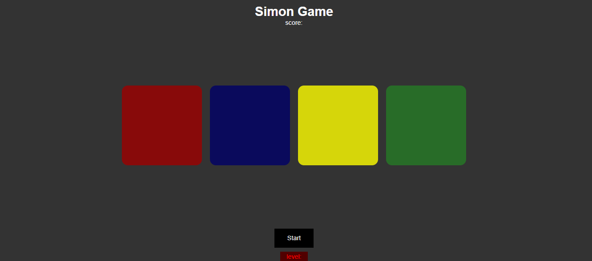

## Simon game 
An electronic game of short-term memory skill invented by Ralph H. Baer and Howard J. Morrison, working for toy design firm Marvin Glass and Associates,[1] with software programming by Lenny Cope. The device creates a series of tones and lights and requires a user to repeat the sequence. If the user succeeds, the series becomes progressively longer and more complex. Once the user fails or the time limit runs out, the game is over. 


# Page



## Featurs 
The device has four colored buttons, each producing a particular tone when it is pressed or activated by the device. A round in the game consists of the device lighting up one or more buttons in a random order, after which the player must reproduce that order by pressing the buttons. As the game progresses, the number of buttons to be pressed increases. (This is only one of the games on the device; there are actually other games on the original.)

## Technology used 
-**HTML** for the structure of web page
-**CSS** for styling and layout 
-**JAFASCRIPT** for game logic and interactivity 

## Getting started 

### Installition 
1. clone the repository 
``` bash git clone https://github.com/Alish9877/simon-game```

2. Navigate the project directory 
``` bash cd simon-game ```

3. Open `index.html` in your browser 

### How to play 

How to Play:
1. Start the Game:
When you start the game, Simon (the game device or app) will randomly light up one of its colored buttons, accompanied by a sound.


2. Observe the Sequence:
You need to watch and listen carefully as Simon lights up the buttons in a specific order, playing the corresponding sound for each color.
The order will start with just one color, and each round, Simon will add one more color to the sequence.

3. Repeat the Sequence:
After Simon finishes showing you the sequence, it's your turn to repeat it by pressing the buttons in the same order.
If you press the correct buttons in the correct order, Simon will light up the next color and add it to the sequence.
If you make a mistake, Simon will show an error and the game will end.

4. Continue:
The game continues to add more colors to the sequence after each successful round. The sequence will get longer and more difficult as you progress.

5. Winning:
There’s no official "winning" point, but the goal is to see how long you can keep up with the growing sequence. The game ends when you make a mistake by pressing the wrong color or failing to repeat the sequence correctly.

